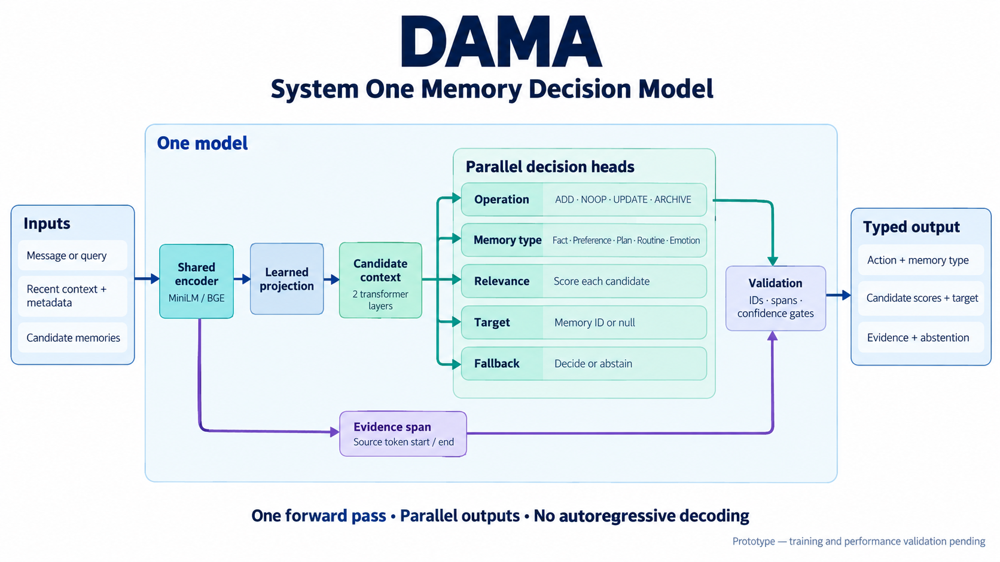

# DAMA — memory decision model

DAMA is a small **System One model for memory decisions**. One forward pass reads a message (or query),
recent turns and candidate memories, and returns a typed decision: **ADD / NOOP / UPDATE / ARCHIVE**,
memory type, which memory to update, the exact evidence span, which memories are relevant, and whether
to fall back to a bigger model. There's no text generation, agent loop or database.



**Status:** the model, data generator, training and evaluation code are implemented and checked with a
tiny random encoder. **No trained checkpoint or measured accuracy exists yet.** Training runs on Colab.

## Layout

| Path | What it is |
|---|---|
| `code/dama/` | The model package: `contracts` (types) → `data` (dataset) → `batching` → `model` → `inference` (decoding) → `training`, `evaluate`, `artifacts` (save/load) |
| `code/configs/` | Four model configs: `minilm-frozen` (default), `minilm-lora`, `bge-frozen`, `bge-lora` |
| `code/colab/DAMA_Colab.ipynb` | Setup → generate data → train → test → try → save |
| `code/requirements.txt` | Dependencies (Colab already has torch) |
| `docs/model-design.md` | How the model works, the data, evaluation and how it relates to the research |
| `research/` | Papers, reports, slides (git-ignored) |

## Train on Colab

Open [the notebook in Colab](https://colab.research.google.com/github/s41r4j/dama/blob/main/code/colab/DAMA_Colab.ipynb),
select a GPU runtime and run the cells in order. `minilm-frozen` trains in minutes on a T4.

## Use locally

```bash
python3.12 -m venv .venv && source .venv/bin/activate
pip install -r code/requirements.txt
export PYTHONPATH=$PWD/code
```

```python
from dama.artifacts import load_model
from dama.inference import Predictor
from dama.contracts import ModelInput, Candidate

model, tokenizer, manifest = load_model("path/to/export")          # downloaded from Colab
predictor = Predictor(model, tokenizer)                             # CPU is fine for inference
decision, timing = predictor.predict(ModelInput(
    task="write", text="We switched from Heroku to Fly.io.",
    candidates=[Candidate(id="host", text="The app is hosted on Heroku.")]))
```

Training is intentionally CUDA-only; `train()` refuses to run on this Mac.
